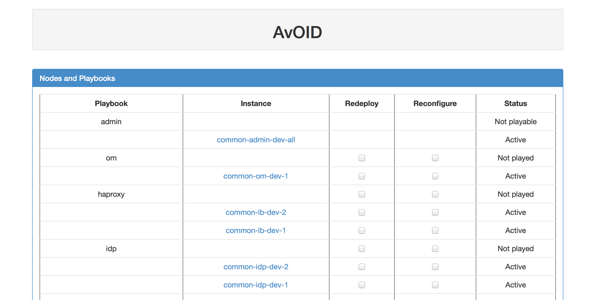

#AvOID
Ansible Openstack Instances Deployer.

The goal of this tool is to allow provisioning several Openstack instances (Virtual Machines), and configure them using Ansible in parallel.

https://www.openstack.org

http://www.ansible.com

This is usefull for continious integration.

## Prerequisite
The tool has been developed/tested on Openstack Havana release.
Ansible playbooks have to be written to configure instances.

## Installation
- git clone https://github.com/OpenTouch/AvOID.git
- cd AvOID
- sudo ./setup.py install

## Usage
Openstack instances and associated Ansible playbook are described in a YAML file named "topology file".

This file includes all required data, for Openstack (credentials, network, image, flavor, ...) and Ansible (Playbook, inventory section)

The tool allows (re)deploying and (re)configuring entire or only parts of topology described in file.

It provides two ways to make deployment from this topology file:

* Command line tool: avoid-cli

* Centralized web server: avoid-web (under construction)

Both are based on avoidlib.


##Topology file
Topology file is in YAML format.

It contains common information and a collection of instances.

Example with three instances:

```
---
- globals:
    env: env_variable_into_ansible
    ssh_key: ./relative/path/to/ssh/key/for/instance/connection
    ssh_user: user_for_ssh_on_instances
    os_user: openstack_user_login
    os_passwd: openstack_user_passwd
    os_tenant: tenant_name
    os_auth_url: http_openstack_auth_url
    os_image: name_of_glance_image
    os_network: name_of_neutron_network
    os_ssh_key: name_of_keypair
    ansible_inventory_template: ./relative/path/to/ansible/inventory/template/file
    ansible_playbooks_directory: ./relative/path/to/directory/containing/ansible/playbooks

  nodes:
    - node:
        name: frontend1
        flavor: m1.small
        ansible_config_keys: frontend
        playbook: frontend
        security: web
        floating_ips: WWW.XXX.YYY.ZZZ
        depends: db
    - node:
        name: db1
        flavor: m1.small
        ansible_config_keys: db
        playbook: db
        volumes:
          - { name: db-volume, size: 1 }
          - { name: db-backup, size: 10 }
    - node:
        name: logs1
        ansible_config_keys: logs
        static:

```
For each instance, following parameters are available:

* **name**: Openstack instance name.
* **flavor**: flavor name in Openstack to use.
* **ansible_config_keys**: collection of section names in Ansible inventory, comma separated.
* **playbook**: playbook file in ansible_playbooks_directory, without extension.
* **security**: Openstack security groups to apply on instance, comma separated.
* **volumes**: cinder volumes attached to instance (collection with name and size)
* **floating_ips**: collection of floating IPs to associate to instance, comma separated. WARNING: IPs are not allocated dynamically to Openstack tenant. In case of several IPs, they are associated to network interfaces (eth0, eth1, ... see additional_network). 
* **additional_network**: collection of additional network names the instance has to be associated with. This will create network interfaces in instances (eth1, ...). eth0 is attached to global 'os_network'
* **vips**: collection virtual IPs, attached to network interfaces (eth0, eth1, ...)
* **depends**: playbook file names (without extension) to be played before running playbook for this instance.
* **groups**: collection of groups instance belongs, comma separated. This is usefull to redeploy or reconfigure a set of nodes.
* **static**: means that instance is not redeployable. Instances without playbook are considered static. 

In case of combining parameters 'floatings_ips', 'additional_network' and 'vips', they have to be consistent (no check).

## How it works ?
Behavior is implemented in avoidlib. This make sequencially:

- [On redeploy] Delete/create instances in parallel 
- Generate Ansible inventory with IP addresses from Openstack
- Run Ansible playbooks in parallel

###Redeploying an instance
- Raise error on static instances
- if instance name exists in Openstack
	- destroy attached volumes if exist
	- destroy instance
- create instance 
	- create attached volume
	- create instance
	- configure security groups, floating ips, VIPs, ...

To destroy/create Openstack volumes/instances, it uses nova and cinder python API. For VIPs ports, it uses neutron python API.


### Generate Ansible inventory

When configuring with Ansible, an inventory file is written by user. Because IP addresses are extracted from Openstack, inventory file has to be transformed into template. To do that, only remove all hosts declared in your Ansible inventory.

According to topology file example, template looks like:


```
[frontend]

[db]

[logs]

[example:children]
frontend
db
logs

```


###Running playbooks in parallel
To configure with ansible, it uses Ansible API to parse playbook files (determine steps in playbooks), and 'ansible-playbook' command to run playbooks (because can't use API to run playbooks in parallel: thread safe problem).


Playbook launch is done according:

- Dependencies: playbook is launch only if all required playbooks have finished (Depends parameter in topology file). In case of not asking running  required playbook, dependency is considered OK
- The maximum number of parallel running playbooks hasn't been reached (10 hardcoded)
- Order of playbooks is computed with priorities. 
	- Priority of a playbook = Number of playbooks depending on this playbook * 100 + number of playbook steps
	- Playbooks with higher priority are played firstly


## Command line tool: avoid-cli
```
Usage avoid-cli: <topology_file.yml> <command> [opts]
  where <command> is:
   - status: list topology status
   - redeploy <list of playbooks or VM names>: terminate VM, spawn a new one and restart playbook
   - redeployall: redeploy all nodes
   - runplaybook <list of playbooks>: restart playbook as it
   - runallplaybooks: restart all playbooks
   - geninventory: generate Ansible inventory file based on topology.yml
```


## Centralized web server: avoid-web
Under development.

This is a web server using Tornado with websockets. It listens on port 8888.
It embeds jquery and bootstrap.

http://jquery.com

http://getbootstrap.com/


```
Usage avoid-web: <topology_file.yml>
```



Test has been done behind NGINX (>1.4 for websocket support) reverse proxy with basic authentication and SSL. 

NGINX configuration looks like:

```
server {
    listen                *:443 ssl;
    server_name           avoid.xxxx;
    access_log            /var/log/nginx/avoid.access.log;
    error_log             /var/log/nginx/avoid.error.log;

    # Certificates
    ssl_certificate       /etc/xxx/yyy;
    ssl_certificate_key   /etc/xxx/yyy;

    location / {
    	proxy_pass http://127.0.0.1:8888;
    	proxy_read_timeout 90;
    	auth_basic "Restricted";
    	auth_basic_user_file /path/to/passwdfile;
    }
    location /ws {
    	proxy_pass http://127.0.0.1:8888/ws;
    	proxy_read_timeout 999999999999;
        proxy_set_header X-Real-IP $remote_addr;
        proxy_set_header Host $host;
        proxy_set_header X-Forwarded-For $proxy_add_x_forwarded_for;

        # WebSocket support (nginx 1.4)
        proxy_http_version 1.1;
        proxy_set_header Upgrade $http_upgrade;
        proxy_set_header Connection "upgrade";
    	auth_basic "Restricted";
    	auth_basic_user_file /path/to/passwdfile;
    }
}
```


For this case, add -wss to 'avoid-web' command line, to use Websocket Secured to allow Javascript connecting to secured websocket.

WARNING: Due to 'Authorization' header (basic authentication), only Firefox works in this case.

### Websocket command line tool: avoid-web-cli
Under development.
The goal of this CLI is to do same than 'avoid-cli', but it connects to server websocket instead of using avoidlib directly.


## Limitations
Tool uses instance/playbook name to identify elements, so it each element have to have a unique name.

## Planned development
Determine dependencies between instances (generate graph): can be done by analysing inventory variable substitution in ansible (not easy).

Support more IaaS (CloudStack, ...).

Provide logs on avoid-web.

## Currently Supported Versions

AvOID is currently available for the following implementations:
- Openstack Havana
- Python 2.x


## License

AvOID is released under Apache 2.0 license.

For further licensing information, please see the contents of the LICENSE file.

## Authors & Contact

Alcatel-Lucent Enterprise (C) 2014,

Personal Cloud R&D <dev@opentouch.net>
